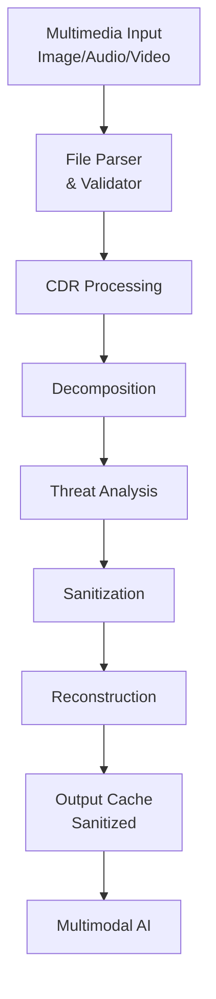

# SAFE-M-49: Multimedia Content Sanitization

## Overview
**Mitigation ID**: SAFE-M-49  
**Category**: Preventive Control  
**Effectiveness**: High  
**Implementation Complexity**: Medium-High  
**First Published**: 2025-10-10

## Description
Multimedia Content Sanitization implements Content Disarm and Reconstruction (CDR) technology to neutralize potential threats embedded within image, audio, and video files before they reach multimodal AI systems. CDR works by deconstructing multimedia files into their component elements, analyzing each component for malicious content, removing or neutralizing threats, and reconstructing the file with only safe elements.

Unlike traditional signature-based scanning that attempts to identify known malware patterns, CDR assumes all files are potentially malicious and removes any elements that could pose a security risk, including steganographic data, executable code, embedded scripts, and suspicious metadata. This approach is particularly effective against zero-day exploits and novel attack vectors that have not yet been catalogued by security vendors.

## Mitigates
- [SAFE-T1110](../../techniques/SAFE-T1110/README.md): Multimodal Prompt Injection via Images/Audio
- [SAFE-T1027](../../techniques/SAFE-T1027/README.md): Obfuscated Files or Information
- [SAFE-T1102](../../techniques/SAFE-T1102/README.md): Prompt Injection (Multiple Vectors)

## Technical Implementation

### Core Principles
1. **Zero Trust Approach**: Treat all multimedia content as potentially malicious regardless of source
2. **Deep File Inspection**: Decompose files to their fundamental elements for thorough analysis
3. **Threat Neutralization**: Remove or sanitize all potentially dangerous components
4. **Format Validation**: Ensure reconstructed files conform to legitimate format specifications

### Architecture Components


### Prerequisites
- File format parsers for supported media types (PNG, JPEG, GIF, MP3, WAV, MP4, etc.)
- Metadata extraction libraries (ExifTool, MediaInfo)
- Steganography detection capabilities
- Format validation engines

### Implementation Steps

1. **Design Phase**:
   - Identify supported multimedia formats
   - Define threat model and sanitization policies
   - Establish performance requirements and SLAs
   - Design caching strategy for processed files

2. **Development Phase**:
   - Implement file format parsers
   - Build threat detection engines
   - Create sanitization and reconstruction logic
   - Develop logging and monitoring infrastructure

3. **Deployment Phase**:
   - Deploy CDR processing pipeline
   - Configure sanitization policies
   - Set up performance monitoring
   - Establish incident response procedures

## Benefits
- **Zero-Day Protection**: Effective against novel and unknown attack vectors
- **Steganography Defense**: Removes hidden data embedded in multimedia files
- **Metadata Cleansing**: Strips potentially malicious EXIF and metadata tags
- **Format Enforcement**: Ensures files conform to legitimate specifications

## Limitations
- **Performance Impact**: CDR processing adds latency to multimedia handling (typically 100-500ms per file)
- **Data Loss**: Aggressive sanitization may remove legitimate but unusual content
- **Format Support**: Limited to supported file formats requiring ongoing maintenance
- **Computational Cost**: Resource-intensive processing for large multimedia files

## Implementation Examples

### Example 1: Image CDR Processing
```python
import hashlib
from datetime import datetime
from PIL import Image
import piexif
import io

class ImageCDR:
    def __init__(self, max_dimension=4096, allowed_formats=['PNG', 'JPEG']):
        self.max_dimension = max_dimension
        self.allowed_formats = allowed_formats
        
    def sanitize_image(self, image_data):
        """
        Perform CDR on image data:
        1. Parse and validate format
        2. Extract pixel data only
        3. Remove all metadata
        4. Reconstruct clean image
        """
        try:
            # Load image
            img = Image.open(io.BytesIO(image_data))
            
            # Validate format
            if img.format not in self.allowed_formats:
                raise ValueError(f"Unsupported format: {img.format}")
            
            # Validate dimensions
            width, height = img.size
            if width > self.max_dimension or height > self.max_dimension:
                raise ValueError(f"Image exceeds maximum dimension: {self.max_dimension}")
            
            # Convert to RGB (removes potential steganographic channels)
            if img.mode not in ['RGB', 'L']:
                img = img.convert('RGB')
            
            # Reconstruct clean image (strips all metadata)
            output = io.BytesIO()
            img.save(output, format='PNG', optimize=False)
            
            sanitized_data = output.getvalue()
            
            # Log sanitization
            self._log_sanitization(
                original_hash=hashlib.sha256(image_data).hexdigest(),
                sanitized_hash=hashlib.sha256(sanitized_data).hexdigest(),
                format=img.format,
                size=img.size
            )
            
            return sanitized_data
            
        except Exception as e:
            # Sanitization failed - reject file
            raise SanitizationError(f"CDR processing failed: {str(e)}")
    
    def _log_sanitization(self, original_hash, sanitized_hash, format, size):
        """Log sanitization events for security monitoring"""
        log_event({
            'event': 'image_cdr',
            'original_hash': original_hash,
            'sanitized_hash': sanitized_hash,
            'format': format,
            'size': size,
            'timestamp': datetime.utcnow().isoformat()
        })
```

### Example 2: Audio File Sanitization
```python
import wave
import numpy as np

class AudioCDR:
    def __init__(self, max_duration_seconds=300, sample_rate=44100):
        self.max_duration = max_duration_seconds
        self.sample_rate = sample_rate
    
    def sanitize_audio(self, audio_data, input_format='wav'):
        """
        Perform CDR on audio data:
        1. Extract raw audio samples
        2. Remove metadata and tags
        3. Normalize audio levels
        4. Reconstruct clean audio file
        """
        # Parse audio file
        with wave.open(io.BytesIO(audio_data), 'rb') as audio:
            # Validate parameters
            channels = audio.getnchannels()
            sample_width = audio.getsampwidth()
            framerate = audio.getframerate()
            n_frames = audio.getnframes()
            
            # Check duration
            duration = n_frames / framerate
            if duration > self.max_duration:
                raise ValueError(f"Audio exceeds max duration: {duration}s")
            
            # Extract raw audio samples
            frames = audio.readframes(n_frames)
        
        # Convert to numpy array for processing
        audio_array = np.frombuffer(frames, dtype=np.int16)
        
        # Normalize levels (removes potential steganographic amplitude variations)
        audio_array = self._normalize_audio(audio_array)
        
        # Reconstruct clean WAV file
        output = io.BytesIO()
        with wave.open(output, 'wb') as clean_audio:
            clean_audio.setnchannels(channels)
            clean_audio.setsampwidth(sample_width)
            clean_audio.setframerate(framerate)
            clean_audio.writeframes(audio_array.tobytes())
        
        return output.getvalue()
    
    def _normalize_audio(self, audio_array):
        """Normalize audio levels to remove potential steganographic data"""
        max_val = np.max(np.abs(audio_array))
        if max_val > 0:
            return (audio_array / max_val * 32767 * 0.9).astype(np.int16)
        return audio_array
```

### Example 3: MCP Integration
```python
from mcp import MCPServer, Content

class CDREnabledMCPServer(MCPServer):
    def __init__(self):
        super().__init__()
        self.image_cdr = ImageCDR()
        self.audio_cdr = AudioCDR()
    
    async def process_content(self, content: Content):
        """Process incoming content with CDR sanitization"""
        if content.type == 'image':
            # Apply image CDR
            sanitized_data = self.image_cdr.sanitize_image(content.data)
            return Content(
                type='image',
                data=sanitized_data,
                mimeType='image/png'  # Always output as PNG
            )
        
        elif content.type == 'audio':
            # Apply audio CDR
            sanitized_data = self.audio_cdr.sanitize_audio(content.data)
            return Content(
                type='audio',
                data=sanitized_data,
                mimeType='audio/wav'  # Always output as WAV
            )
        
        return content
```

## Testing and Validation

1. **Security Testing**:
   - Test with known steganographic payloads
   - Verify removal of metadata and EXIF data
   - Attempt polyglot file attacks
   - Test with adversarial multimedia samples

2. **Functional Testing**:
   - Ensure legitimate files are properly processed
   - Verify visual/audio quality preservation
   - Measure processing latency and throughput
   - Test with various file formats and sizes

3. **Integration Testing**:
   - Validate MCP protocol compatibility
   - Test with multimodal AI systems
   - Verify error handling and logging
   - Test caching and performance optimization

## Deployment Considerations

### Resource Requirements
- **CPU**: 2-4 cores per concurrent stream
- **Memory**: 512MB-2GB per concurrent file (depends on file size)
- **Storage**: Cache storage for processed files (optional but recommended)
- **Network**: Low latency connection to MCP servers

### Performance Impact
- **Latency**: 100-500ms additional processing time per file
- **Throughput**: 10-50 files/second per instance (hardware dependent)
- **Resource Usage**: High CPU during processing, moderate memory

### Monitoring and Alerting
- CDR processing success/failure rates
- Processing latency (p50, p95, p99)
- File rejection reasons and patterns
- Resource utilization (CPU, memory)
- Cache hit rates (if caching enabled)
- Suspicious file patterns detected

## Configuration Example

```yaml
cdr_config:
  enabled: true
  
  image:
    max_dimension: 4096
    allowed_formats: ['PNG', 'JPEG', 'GIF']
    remove_metadata: true
    output_format: 'PNG'
    
  audio:
    max_duration_seconds: 300
    allowed_formats: ['WAV', 'MP3']
    sample_rate: 44100
    normalize_levels: true
    output_format: 'WAV'
  
  processing:
    timeout_seconds: 30
    max_file_size_mb: 50
    cache_enabled: true
    cache_ttl_seconds: 3600
  
  security:
    reject_on_failure: true
    log_all_files: true
    quarantine_suspicious: true
```

## Current Status (2025)
According to industry reports, CDR technology is widely adopted in enterprise environments:
- OPSWAT MetaDefender provides commercial CDR solutions for multimedia files
- Votiro implements CDR for document and image sanitization in government sectors
- Deep Secure offers CDR platforms for critical infrastructure protection

## References
- [NIST SP 800-160 Vol. 2 Rev. 1: Systems Security Engineering](https://csrc.nist.gov/publications/detail/sp/800-160/vol-2-rev-1/final)
- [Image-Based Malware Threats - OPSWAT Blog](https://www.opswat.com/blog/how-emerging-image-based-malware-attacks-threaten-enterprise-defenses)
- [Steganography Detection Techniques - IEEE Security & Privacy](https://ieeexplore.ieee.org/document/6828087)
- [Model Context Protocol Specification](https://modelcontextprotocol.io/specification/2025-06-18)

## Related Mitigations
- [SAFE-M-50](../SAFE-M-50/README.md): OCR Security Scanning - Complements CDR by analyzing extracted text
- [SAFE-M-52](../SAFE-M-52/README.md): Input Validation Pipeline - Provides additional validation layer
- [SAFE-M-10](../SAFE-M-10/README.md): Automated Scanning - Pattern-based detection complement

## Version History
|| Version | Date | Changes | Author |
||---------|------|---------|--------|
|| 1.0 | 2025-10-10 | Initial documentation | Sumit Yadav(rockerritesh) |

