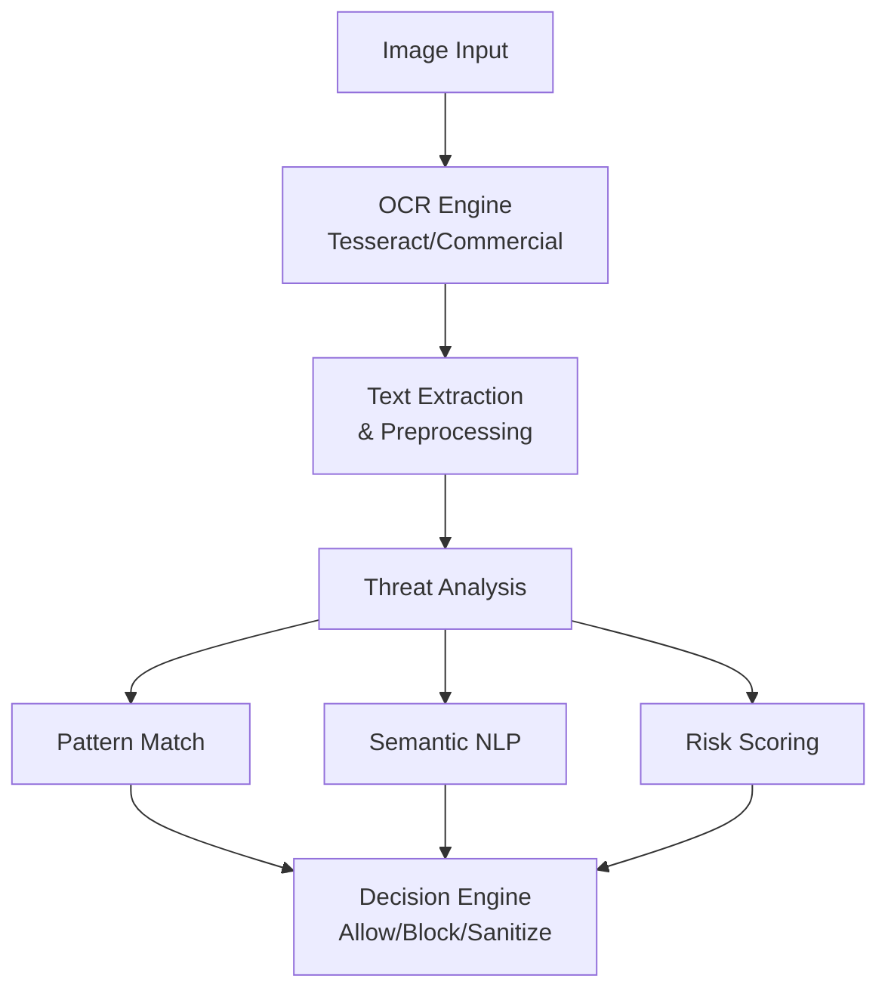

# SAFE-M-50: OCR Security Scanning

## Overview
**Mitigation ID**: SAFE-M-50  
**Category**: Detective Control  
**Effectiveness**: Medium-High  
**Implementation Complexity**: Medium  
**First Published**: 2025-10-10

## Description
OCR Security Scanning employs Optical Character Recognition (OCR) technology to extract and analyze text embedded within images and multimedia content submitted to multimodal AI systems. This mitigation addresses attacks where malicious instructions are visually embedded in images as readable text, exploiting the visual processing capabilities of vision-language models while bypassing text-based security filters.

The technique works by performing OCR extraction on all image inputs, analyzing the extracted text for malicious patterns (prompt injection attempts, command injections, sensitive data exfiltration requests), and either blocking or sanitizing content based on detected threats. This approach is particularly effective against attacks documented in research papers such as "Abusing Images and Sounds for Indirect Instruction Injection" (Greshake et al., 2023) where invisible or subtle text in images manipulates AI behavior.

## Mitigates
- [SAFE-T1110](../../techniques/SAFE-T1110/README.md): Multimodal Prompt Injection via Images/Audio
- [SAFE-T1102](../../techniques/SAFE-T1102/README.md): Prompt Injection (Multiple Vectors)
- [SAFE-T1402](../../techniques/SAFE-T1402/README.md): Instruction Steganography

## Technical Implementation

### Core Principles
1. **Universal OCR Application**: Extract text from all image inputs regardless of apparent content
2. **Multi-Language Detection**: Support detection across multiple languages and character sets
3. **Semantic Analysis**: Analyze extracted text for malicious intent, not just pattern matching
4. **Context-Aware Filtering**: Consider legitimate use cases while detecting threats

### Architecture Components


### Prerequisites
- OCR engine (Tesseract, Google Vision API, AWS Textract, Azure Computer Vision)
- NLP libraries for semantic analysis (spaCy, Transformers)
- Pattern matching capabilities (regex, YARA)
- Threat intelligence database of known malicious patterns

### Implementation Steps

1. **Design Phase**:
   - Select OCR engine based on accuracy and performance requirements
   - Define threat patterns and detection rules
   - Establish risk scoring methodology
   - Design integration with existing security infrastructure

2. **Development Phase**:
   - Implement OCR extraction pipeline
   - Build semantic analysis engine
   - Create threat detection rule engine
   - Develop logging and alerting system

3. **Deployment Phase**:
   - Deploy OCR scanning service
   - Configure detection rules and thresholds
   - Set up monitoring and alerting
   - Train security team on response procedures

## Benefits
- **Visual Injection Detection**: Detects text-based attacks embedded in images
- **Invisible Text Discovery**: Identifies hidden text using color manipulation or small fonts
- **Multi-Language Support**: Detects threats in various languages and character sets
- **Semantic Understanding**: Uses NLP to identify malicious intent beyond keyword matching

## Limitations
- **OCR Accuracy**: May miss obfuscated or poorly rendered text (typical accuracy: 85-95%)
- **Performance Impact**: OCR processing adds latency (100-300ms per image)
- **False Positives**: Legitimate text in images may trigger false alarms
- **Evasion Techniques**: Attackers may use adversarial fonts or visual obfuscation

## Implementation Examples

### Example 1: Basic OCR Security Scanner
```python
import pytesseract
from PIL import Image
import io
import re

class OCRSecurityScanner:
    def __init__(self):
        # Common prompt injection patterns
        self.malicious_patterns = [
            r'ignore\s+(all\s+)?previous\s+instructions',
            r'system\s*:\s*you\s+are',
            r'<\s*system\s*>',
            r'rm\s+-rf\s+/',
            r'DELETE\s+FROM\s+\w+',
            r'eval\s*\(',
            r'exec\s*\(',
            r'__import__',
            r'os\.system',
        ]
        
        # Compile patterns
        self.compiled_patterns = [
            re.compile(pattern, re.IGNORECASE) 
            for pattern in self.malicious_patterns
        ]
    
    def scan_image(self, image_data):
        """
        Extract text from image and analyze for threats
        Returns: dict with findings and risk score
        """
        try:
            # Load image
            img = Image.open(io.BytesIO(image_data))
            
            # Perform OCR
            extracted_text = pytesseract.image_to_string(img)
            
            # Analyze extracted text
            findings = self._analyze_text(extracted_text)
            
            return {
                'extracted_text': extracted_text,
                'findings': findings,
                'risk_score': self._calculate_risk_score(findings),
                'decision': self._make_decision(findings)
            }
            
        except Exception as e:
            return {
                'error': str(e),
                'risk_score': 0.0,
                'decision': 'error'
            }
    
    def _analyze_text(self, text):
        """Analyze text for malicious patterns"""
        findings = []
        
        for pattern, compiled_pattern in zip(
            self.malicious_patterns, 
            self.compiled_patterns
        ):
            matches = compiled_pattern.findall(text)
            if matches:
                findings.append({
                    'pattern': pattern,
                    'matches': matches,
                    'severity': 'high'
                })
        
        # Check for invisible characters
        if self._has_invisible_chars(text):
            findings.append({
                'pattern': 'invisible_characters',
                'severity': 'medium'
            })
        
        return findings
    
    def _has_invisible_chars(self, text):
        """Detect zero-width and other invisible characters"""
        invisible_chars = [
            '\u200B',  # Zero-width space
            '\u200C',  # Zero-width non-joiner
            '\u200D',  # Zero-width joiner
            '\uFEFF',  # Zero-width no-break space
        ]
        return any(char in text for char in invisible_chars)
    
    def _calculate_risk_score(self, findings):
        """Calculate risk score based on findings"""
        if not findings:
            return 0.0
        
        severity_weights = {
            'high': 0.8,
            'medium': 0.5,
            'low': 0.2
        }
        
        total_score = sum(
            severity_weights.get(f.get('severity', 'low'), 0.2)
            for f in findings
        )
        
        return min(total_score, 1.0)
    
    def _make_decision(self, findings):
        """Make allow/block/review decision"""
        risk_score = self._calculate_risk_score(findings)
        
        if risk_score >= 0.7:
            return 'block'
        elif risk_score >= 0.4:
            return 'review'
        else:
            return 'allow'
```

### Example 2: Advanced Semantic Analysis
```python
from transformers import pipeline
import spacy

class SemanticOCRScanner:
    def __init__(self):
        # Load NLP models
        self.nlp = spacy.load('en_core_web_sm')
        self.classifier = pipeline(
            'text-classification',
            model='distilbert-base-uncased-finetuned-sst-2-english'
        )
        
        # Load prompt injection detector (fine-tuned model)
        self.injection_detector = pipeline(
            'text-classification',
            model='protectai/deberta-v3-base-prompt-injection-v2'
        )
    
    def analyze_extracted_text(self, text):
        """
        Perform semantic analysis on OCR-extracted text
        """
        if not text or len(text.strip()) < 10:
            return {
                'risk_score': 0.0,
                'analysis': 'insufficient_text'
            }
        
        # Analyze for prompt injection
        injection_result = self.injection_detector(text[:512])[0]
        
        # Perform linguistic analysis
        doc = self.nlp(text)
        
        # Check for command-like structures
        has_commands = self._detect_commands(doc)
        
        # Check for system-level language
        has_system_language = self._detect_system_language(doc)
        
        # Calculate combined risk score
        risk_score = self._calculate_semantic_risk(
            injection_result,
            has_commands,
            has_system_language
        )
        
        return {
            'risk_score': risk_score,
            'injection_detected': injection_result['label'] == 'INJECTION',
            'injection_confidence': injection_result['score'],
            'has_commands': has_commands,
            'has_system_language': has_system_language,
            'entities': [(ent.text, ent.label_) for ent in doc.ents]
        }
    
    def _detect_commands(self, doc):
        """Detect command-like structures in text"""
        command_verbs = {'execute', 'run', 'delete', 'remove', 'drop', 
                        'eval', 'exec', 'import', 'load'}
        
        return any(
            token.lemma_.lower() in command_verbs 
            for token in doc 
            if token.pos_ == 'VERB'
        )
    
    def _detect_system_language(self, doc):
        """Detect system-level or privileged language"""
        system_keywords = {'system', 'admin', 'root', 'sudo', 'privilege',
                          'override', 'bypass', 'ignore'}
        
        text_lower = doc.text.lower()
        return any(keyword in text_lower for keyword in system_keywords)
    
    def _calculate_semantic_risk(self, injection_result, has_commands, 
                                 has_system_language):
        """Calculate risk score from semantic features"""
        risk_score = 0.0
        
        # Injection detection contribution
        if injection_result['label'] == 'INJECTION':
            risk_score += injection_result['score'] * 0.6
        
        # Command detection contribution
        if has_commands:
            risk_score += 0.2
        
        # System language contribution
        if has_system_language:
            risk_score += 0.2
        
        return min(risk_score, 1.0)
```

### Example 3: MCP Integration
```python
from mcp import MCPServer, Content

class OCRProtectedMCPServer(MCPServer):
    def __init__(self):
        super().__init__()
        self.basic_scanner = OCRSecurityScanner()
        self.semantic_scanner = SemanticOCRScanner()
    
    async def process_image_content(self, content: Content):
        """Process image with OCR security scanning"""
        # Perform basic OCR scanning
        basic_scan = self.basic_scanner.scan_image(content.data)
        
        # If text detected, perform semantic analysis
        if basic_scan['extracted_text']:
            semantic_analysis = self.semantic_scanner.analyze_extracted_text(
                basic_scan['extracted_text']
            )
            
            # Combine results
            combined_risk = max(
                basic_scan['risk_score'],
                semantic_analysis['risk_score']
            )
            
            # Log security event
            self._log_security_scan({
                'content_type': 'image',
                'basic_scan': basic_scan,
                'semantic_analysis': semantic_analysis,
                'final_risk_score': combined_risk
            })
            
            # Make decision
            if combined_risk >= 0.7:
                raise SecurityException(
                    f"Image blocked: malicious text detected (risk: {combined_risk:.2f})"
                )
            elif combined_risk >= 0.4:
                # Queue for human review
                await self._queue_for_review(content, combined_risk)
                raise PendingReviewException("Image pending security review")
        
        return content
```

## Testing and Validation

1. **Security Testing**:
   - Test with known visual prompt injection samples
   - Verify detection of invisible text (zero-width characters, white-on-white)
   - Test with adversarial fonts and obfuscated text
   - Validate multi-language detection capabilities

2. **Functional Testing**:
   - Ensure legitimate images with text are not falsely blocked
   - Measure OCR accuracy across various image qualities
   - Test performance under load
   - Validate error handling and logging

3. **Integration Testing**:
   - Test with multimodal AI systems
   - Verify MCP protocol compatibility
   - Test alert and notification systems
   - Validate forensic logging

## Deployment Considerations

### Resource Requirements
- **CPU**: 1-2 cores per concurrent OCR operation
- **Memory**: 512MB-1GB per concurrent operation
- **Storage**: Minimal (logs and quarantined content)
- **Network**: Low latency to OCR API (if using cloud services)

### Performance Impact
- **Latency**: 100-300ms additional processing time
- **Throughput**: 20-100 images/second (depends on OCR engine)
- **Resource Usage**: Moderate CPU, low memory

### Monitoring and Alerting
- OCR extraction success rate
- Processing latency metrics
- Threat detection rate
- False positive/negative rates
- Text detection patterns and trends

## Configuration Example

```yaml
ocr_security:
  enabled: true
  
  ocr_engine:
    provider: 'tesseract'  # or 'google', 'aws', 'azure'
    languages: ['eng', 'spa', 'fra', 'deu', 'chi_sim']
    confidence_threshold: 60
  
  detection:
    pattern_matching: true
    semantic_analysis: true
    ml_detection: true
    
  thresholds:
    block: 0.7
    review: 0.4
  
  processing:
    timeout_seconds: 10
    max_image_size_mb: 20
    cache_results: true
    cache_ttl_seconds: 3600
  
  logging:
    log_all_extractions: false
    log_threats_only: true
    include_extracted_text: true
```

## Current Status (2025)
According to security research, OCR-based attacks are increasingly prevalent:
- Research paper "Abusing Images and Sounds for Indirect Instruction Injection" (Greshake et al., 2023) demonstrated successful attacks using visually embedded text
- Vision-language models like GPT-4V and Gemini are vulnerable to OCR-based prompt injection
- Commercial OCR security solutions are emerging from vendors like Abnormal Security and Darktrace

## References
- [Abusing Images and Sounds for Indirect Instruction Injection in Multi-Modal LLMs - arXiv:2307.10490](https://arxiv.org/abs/2307.10490)
- [Not what you've signed up for: Compromising Real-World LLM-Integrated Applications - arXiv:2302.12173](https://arxiv.org/abs/2302.12173)
- [Prompt Injection Detection with deberta-v3 - HuggingFace ProtectAI](https://huggingface.co/protectai/deberta-v3-base-prompt-injection-v2)
- [Tesseract OCR Engine Documentation](https://github.com/tesseract-ocr/tesseract)
- [Google Cloud Vision API](https://cloud.google.com/vision)
- [AWS Textract Documentation](https://aws.amazon.com/textract/)
- [Model Context Protocol Specification](https://modelcontextprotocol.io/specification)

## Related Mitigations
- [SAFE-M-49](../SAFE-M-49/README.md): Multimedia Content Sanitization - Removes threats before OCR
- [SAFE-M-3](../SAFE-M-3/README.md): AI-Powered Content Analysis - Semantic analysis complement
- [SAFE-M-51](../SAFE-M-51/README.md): Embedding Anomaly Detection - Detects non-text visual attacks

## Version History
|| Version | Date | Changes | Author |
||---------|------|---------|--------|
|| 1.0 | 2025-10-10 | Initial documentation | Sumit Yadav(rockerritesh) |

