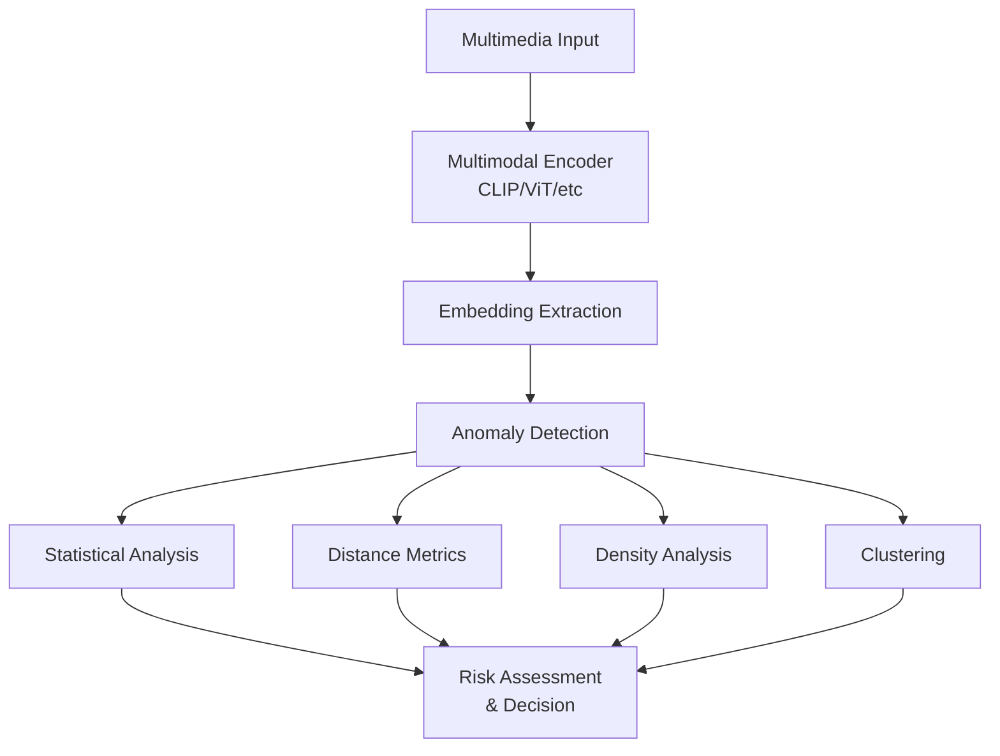

# SAFE-M-51: Embedding Anomaly Detection

## Overview
**Mitigation ID**: SAFE-M-51  
**Category**: AI-Based Defense  
**Effectiveness**: Medium-High  
**Implementation Complexity**: High  
**First Published**: 2025-10-10

## Description
Embedding Anomaly Detection uses machine learning to identify adversarial patterns and anomalies in multimodal embeddings generated from image, audio, and video inputs. This mitigation detects attacks that operate at the embedding level—below the threshold of human perception—where adversarial perturbations manipulate the vector representations used by vision-language models without creating visible or audible changes to the content.

Unlike traditional signature-based detection that analyzes raw file content, this approach examines the mathematical representations (embeddings) that multimodal AI systems use internally. By establishing baseline patterns for normal embeddings and detecting statistical anomalies, this mitigation can identify adversarial content crafted to exploit the geometric properties of embedding spaces, as documented in research on adversarial attacks against vision-language models.

## Mitigates
- [SAFE-T1110](../../techniques/SAFE-T1110/README.md): Multimodal Prompt Injection via Images/Audio
- [SAFE-T1102](../../techniques/SAFE-T1102/README.md): Prompt Injection (Multiple Vectors)
- [SAFE-T1027](../../techniques/SAFE-T1027/README.md): Obfuscated Files or Information

## Technical Implementation

### Core Principles
1. **Embedding Space Analysis**: Monitor the geometric properties of multimodal embeddings
2. **Statistical Baseline**: Establish normal distribution patterns for legitimate content
3. **Anomaly Detection**: Identify embeddings that deviate from expected distributions
4. **Cross-Modal Consistency**: Verify consistency between different modality embeddings

### Architecture Components


### Prerequisites
- Multimodal embedding model (CLIP, ImageBind, ALIGN, etc.)
- Baseline dataset of legitimate multimedia content
- Anomaly detection algorithms (Isolation Forest, One-Class SVM, Autoencoders)
- Vector database for efficient similarity search

### Implementation Steps

1. **Design Phase**:
   - Select embedding model compatible with target AI system
   - Define anomaly detection methodology
   - Establish baseline data collection strategy
   - Design decision thresholds and alerting logic

2. **Development Phase**:
   - Implement embedding extraction pipeline
   - Train anomaly detection models on baseline data
   - Build real-time detection service
   - Create monitoring and logging infrastructure

3. **Deployment Phase**:
   - Deploy embedding analysis service
   - Configure detection thresholds
   - Set up continuous model retraining
   - Establish incident response procedures

## Benefits
- **Perceptual Agnostic**: Detects attacks invisible to humans
- **Model-Level Defense**: Operates at the same level as the AI system
- **Novel Attack Detection**: Can identify zero-day adversarial patterns
- **Cross-Modal Analysis**: Detects inconsistencies across modalities

## Limitations
- **High Computational Cost**: Requires embedding generation and analysis for all inputs
- **Baseline Dependency**: Effectiveness depends on quality of baseline data
- **False Positives**: Unusual but legitimate content may trigger alerts
- **Model Drift**: Requires continuous retraining as content patterns evolve

## Implementation Examples

### Example 1: CLIP-Based Embedding Analysis
```python
import torch
import numpy as np
from transformers import CLIPProcessor, CLIPModel
from sklearn.ensemble import IsolationForest
from sklearn.preprocessing import StandardScaler

class EmbeddingAnomalyDetector:
    def __init__(self, model_name='openai/clip-vit-base-patch32'):
        # Load CLIP model
        self.model = CLIPModel.from_pretrained(model_name)
        self.processor = CLIPProcessor.from_pretrained(model_name)
        self.model.eval()
        
        # Anomaly detection components
        self.isolation_forest = None
        self.scaler = StandardScaler()
        self.baseline_embeddings = []
        
    def extract_image_embedding(self, image):
        """Extract CLIP embedding from image"""
        inputs = self.processor(images=image, return_tensors="pt")
        
        with torch.no_grad():
            image_features = self.model.get_image_features(**inputs)
        
        # Normalize embedding
        embedding = image_features / image_features.norm(dim=-1, keepdim=True)
        return embedding.cpu().numpy().flatten()
    
    def train_baseline(self, legitimate_images):
        """
        Train anomaly detector on baseline of legitimate images
        """
        print(f"Extracting embeddings from {len(legitimate_images)} baseline images...")
        
        # Extract embeddings from baseline
        self.baseline_embeddings = []
        for img in legitimate_images:
            embedding = self.extract_image_embedding(img)
            self.baseline_embeddings.append(embedding)
        
        embeddings_array = np.array(self.baseline_embeddings)
        
        # Normalize features
        embeddings_scaled = self.scaler.fit_transform(embeddings_array)
        
        # Train Isolation Forest
        self.isolation_forest = IsolationForest(
            contamination=0.1,  # Expect ~10% anomalies
            random_state=42,
            n_estimators=100
        )
        self.isolation_forest.fit(embeddings_scaled)
        
        print("Baseline training complete")
    
    def detect_anomaly(self, image):
        """
        Analyze image embedding for anomalies
        Returns: dict with anomaly score and decision
        """
        # Extract embedding
        embedding = self.extract_image_embedding(image)
        
        # Scale embedding
        embedding_scaled = self.scaler.transform(embedding.reshape(1, -1))
        
        # Calculate anomaly score
        anomaly_score = self.isolation_forest.decision_function(embedding_scaled)[0]
        is_anomaly = self.isolation_forest.predict(embedding_scaled)[0] == -1
        
        # Calculate distance metrics
        distances = self._calculate_distances(embedding)
        
        # Calculate combined risk score
        risk_score = self._calculate_risk_score(
            anomaly_score, 
            distances,
            is_anomaly
        )
        
        return {
            'is_anomaly': is_anomaly,
            'anomaly_score': float(anomaly_score),
            'risk_score': risk_score,
            'nearest_neighbor_distance': distances['min_distance'],
            'mean_distance': distances['mean_distance'],
            'decision': self._make_decision(risk_score)
        }
    
    def _calculate_distances(self, embedding):
        """Calculate distances to baseline embeddings"""
        if not self.baseline_embeddings:
            return {'min_distance': 0.0, 'mean_distance': 0.0}
        
        baseline_array = np.array(self.baseline_embeddings)
        
        # Calculate cosine distances
        similarities = np.dot(baseline_array, embedding)
        distances = 1 - similarities
        
        return {
            'min_distance': float(np.min(distances)),
            'mean_distance': float(np.mean(distances)),
            'std_distance': float(np.std(distances))
        }
    
    def _calculate_risk_score(self, anomaly_score, distances, is_anomaly):
        """Calculate risk score from multiple signals"""
        # Normalize anomaly score to [0, 1]
        # Isolation Forest scores are typically in range [-0.5, 0.5]
        normalized_anomaly = max(0, min(1, (-anomaly_score + 0.5)))
        
        # Distance-based risk
        distance_risk = min(1, distances['min_distance'] * 2)
        
        # Combine signals
        risk_score = (
            0.6 * normalized_anomaly +
            0.3 * distance_risk +
            0.1 * (1.0 if is_anomaly else 0.0)
        )
        
        return risk_score
    
    def _make_decision(self, risk_score):
        """Make allow/block/review decision"""
        if risk_score >= 0.7:
            return 'block'
        elif risk_score >= 0.4:
            return 'review'
        else:
            return 'allow'
```

### Example 2: Autoencoder-Based Anomaly Detection
```python
import torch
import torch.nn as nn
import torch.optim as optim

class EmbeddingAutoencoder(nn.Module):
    def __init__(self, embedding_dim=512, latent_dim=128):
        super().__init__()
        
        # Encoder
        self.encoder = nn.Sequential(
            nn.Linear(embedding_dim, 256),
            nn.ReLU(),
            nn.Linear(256, latent_dim),
            nn.ReLU()
        )
        
        # Decoder
        self.decoder = nn.Sequential(
            nn.Linear(latent_dim, 256),
            nn.ReLU(),
            nn.Linear(256, embedding_dim),
        )
    
    def forward(self, x):
        encoded = self.encoder(x)
        decoded = self.decoder(encoded)
        return decoded

class AutoencoderAnomalyDetector:
    def __init__(self, embedding_dim=512, latent_dim=128):
        self.autoencoder = EmbeddingAutoencoder(embedding_dim, latent_dim)
        self.threshold = None
        self.embedding_dim = embedding_dim
    
    def train_autoencoder(self, baseline_embeddings, epochs=50):
        """Train autoencoder on baseline embeddings"""
        embeddings_tensor = torch.FloatTensor(baseline_embeddings)
        
        optimizer = optim.Adam(self.autoencoder.parameters(), lr=0.001)
        criterion = nn.MSELoss()
        
        self.autoencoder.train()
        
        for epoch in range(epochs):
            optimizer.zero_grad()
            reconstructed = self.autoencoder(embeddings_tensor)
            loss = criterion(reconstructed, embeddings_tensor)
            loss.backward()
            optimizer.step()
            
            if epoch % 10 == 0:
                print(f"Epoch {epoch}: Loss = {loss.item():.4f}")
        
        # Calculate threshold from baseline
        self.autoencoder.eval()
        with torch.no_grad():
            reconstructed = self.autoencoder(embeddings_tensor)
            reconstruction_errors = torch.mean(
                (embeddings_tensor - reconstructed) ** 2, 
                dim=1
            )
            # Set threshold at 95th percentile
            self.threshold = torch.quantile(reconstruction_errors, 0.95).item()
        
        print(f"Training complete. Threshold: {self.threshold:.4f}")
    
    def detect_anomaly(self, embedding):
        """Detect anomaly using reconstruction error"""
        self.autoencoder.eval()
        
        embedding_tensor = torch.FloatTensor(embedding).unsqueeze(0)
        
        with torch.no_grad():
            reconstructed = self.autoencoder(embedding_tensor)
            reconstruction_error = torch.mean(
                (embedding_tensor - reconstructed) ** 2
            ).item()
        
        is_anomaly = reconstruction_error > self.threshold
        
        # Normalize risk score
        risk_score = min(1.0, reconstruction_error / (self.threshold * 2))
        
        return {
            'is_anomaly': is_anomaly,
            'reconstruction_error': reconstruction_error,
            'threshold': self.threshold,
            'risk_score': risk_score,
            'decision': 'block' if risk_score > 0.7 else 'allow'
        }
```

### Example 3: MCP Integration with Multiple Detection Methods
```python
from mcp import MCPServer, Content
from PIL import Image
import io

class EmbeddingProtectedMCPServer(MCPServer):
    def __init__(self):
        super().__init__()
        
        # Initialize detectors
        self.embedding_detector = EmbeddingAnomalyDetector()
        self.autoencoder_detector = AutoencoderAnomalyDetector()
        
        # Load and train on baseline
        self._initialize_detectors()
    
    def _initialize_detectors(self):
        """Initialize and train anomaly detectors"""
        # Load baseline dataset (implementation specific)
        baseline_images = self._load_baseline_images()
        
        # Train embedding detector
        self.embedding_detector.train_baseline(baseline_images)
        
        # Extract embeddings for autoencoder
        baseline_embeddings = [
            self.embedding_detector.extract_image_embedding(img)
            for img in baseline_images
        ]
        
        # Train autoencoder
        self.autoencoder_detector.train_autoencoder(baseline_embeddings)
    
    async def process_image_content(self, content: Content):
        """Process image with embedding anomaly detection"""
        # Load image
        image = Image.open(io.BytesIO(content.data))
        
        # Run both detectors
        isolation_result = self.embedding_detector.detect_anomaly(image)
        autoencoder_result = self.autoencoder_detector.detect_anomaly(
            self.embedding_detector.extract_image_embedding(image)
        )
        
        # Combine results
        combined_risk = max(
            isolation_result['risk_score'],
            autoencoder_result['risk_score']
        )
        
        # Log security analysis
        self._log_embedding_analysis({
            'content_type': 'image',
            'isolation_forest': isolation_result,
            'autoencoder': autoencoder_result,
            'combined_risk': combined_risk
        })
        
        # Make decision
        if combined_risk >= 0.7:
            raise SecurityException(
                f"Image blocked: embedding anomaly detected (risk: {combined_risk:.2f})"
            )
        elif combined_risk >= 0.4:
            await self._queue_for_review(content, combined_risk)
            raise PendingReviewException(
                "Image pending review: potential embedding anomaly"
            )
        
        return content
```

## Testing and Validation

1. **Security Testing**:
   - Test with known adversarial examples (FGSM, PGD, C&W attacks)
   - Verify detection of perturbations below human perception threshold
   - Test with adversarial patches and universal perturbations
   - Validate cross-modal consistency checking

2. **Functional Testing**:
   - Ensure legitimate unusual content is properly handled
   - Measure false positive rates on diverse test sets
   - Test performance under load
   - Validate continuous learning and adaptation

3. **Integration Testing**:
   - Test with production multimodal AI systems
   - Verify MCP protocol compatibility
   - Test alert and response workflows
   - Validate forensic logging and analysis

## Deployment Considerations

### Resource Requirements
- **CPU**: 2-4 cores per concurrent analysis
- **Memory**: 2-4GB per instance (model dependent)
- **Storage**: Moderate (baseline embeddings, models)
- **GPU**: Optional but recommended for faster embedding extraction

### Performance Impact
- **Latency**: 50-200ms additional processing time
- **Throughput**: 20-100 items/second (hardware dependent)
- **Resource Usage**: Moderate to high CPU/GPU during embedding extraction

### Monitoring and Alerting
- Anomaly detection rate over time
- Risk score distribution
- False positive/negative rates
- Baseline drift metrics
- Model performance degradation
- Processing latency and throughput

## Configuration Example

```yaml
embedding_anomaly_detection:
  enabled: true
  
  embedding_model:
    name: 'openai/clip-vit-base-patch32'
    device: 'cuda'  # or 'cpu'
    batch_size: 16
  
  detection_methods:
    isolation_forest:
      enabled: true
      contamination: 0.1
      n_estimators: 100
    
    autoencoder:
      enabled: true
      latent_dim: 128
      training_epochs: 50
  
  thresholds:
    block: 0.7
    review: 0.4
  
  baseline:
    update_frequency_hours: 24
    min_samples: 1000
    max_age_days: 30
  
  performance:
    timeout_seconds: 5
    cache_embeddings: true
    cache_ttl_seconds: 3600
```

## Current Status (2025)
According to security research, embedding-level attacks are an emerging threat:
- Research paper "Visual Adversarial Examples Jailbreak Large Language Models" (Qi et al., 2024) demonstrated successful attacks at the embedding level
- Studies on CLIP and other vision-language models show vulnerability to adversarial perturbations
- Anomaly detection in embedding spaces is an active area of research in adversarial ML

## References
- [Visual Adversarial Examples Jailbreak Large Language Models - arXiv:2306.13213](https://arxiv.org/abs/2306.13213)
- [Adversarial Attacks on Multimodal Models - arXiv:2409.06793](https://arxiv.org/abs/2409.06793)
- [CLIP: Learning Transferable Visual Models - OpenAI](https://openai.com/research/clip)
- [Isolation Forest Algorithm - IEEE Transactions](https://ieeexplore.ieee.org/document/4781136)
- [Deep Anomaly Detection - ACM Computing Surveys](https://dl.acm.org/doi/10.1145/3439950)
- [Model Context Protocol Specification](https://modelcontextprotocol.io/specification)

## Related Mitigations
- [SAFE-M-49](../SAFE-M-49/README.md): Multimedia Content Sanitization - Pre-processing complement
- [SAFE-M-50](../SAFE-M-50/README.md): OCR Security Scanning - Detects text-based attacks
- [SAFE-M-53](../SAFE-M-53/README.md): Multimodal Behavioral Monitoring - Post-processing detection

## Version History
|| Version | Date | Changes | Author |
||---------|------|---------|--------|
|| 1.0 | 2025-10-10 | Initial documentation | Sumit Yadav(rockerritesh) |

