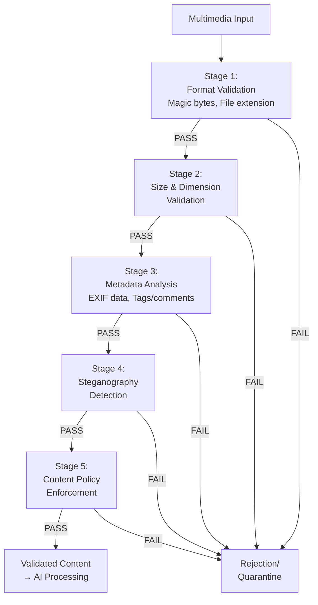

# SAFE-M-52: Input Validation Pipeline

## Overview
**Mitigation ID**: SAFE-M-52  
**Category**: Preventive Control  
**Effectiveness**: High  
**Implementation Complexity**: Medium  
**First Published**: 2025-10-10

## Description
Input Validation Pipeline implements a comprehensive, multi-layered validation framework for multimedia content submitted to multimodal AI systems. This mitigation establishes a defense-in-depth approach by validating file format integrity, checking file size and dimensions, detecting steganographic content, verifying metadata consistency, and enforcing content policies before multimedia reaches the AI processing layer.

Unlike single-point validation checks, this pipeline approach ensures that malicious content must bypass multiple independent validation stages, significantly reducing the attack surface. The pipeline architecture allows for flexible configuration, enabling organizations to balance security requirements with performance needs and customize validation rules based on their specific threat model.

## Mitigates
- [SAFE-T1110](../../techniques/SAFE-T1110/README.md): Multimodal Prompt Injection via Images/Audio
- [SAFE-T1027](../../techniques/SAFE-T1027/README.md): Obfuscated Files or Information
- [SAFE-T1102](../../techniques/SAFE-T1102/README.md): Prompt Injection (Multiple Vectors)

## Technical Implementation

### Core Principles
1. **Defense in Depth**: Multiple independent validation layers
2. **Fail Secure**: Reject content that fails any validation stage
3. **Configurable Policy**: Flexible rules based on risk tolerance
4. **Comprehensive Logging**: Audit trail for all validation decisions

### Architecture Components


### Prerequisites
- File format libraries (python-magic, Pillow, mutagen)
- Steganography detection tools (stegdetect, StegExpose)
- Metadata extraction tools (ExifTool)
- Policy engine for rule enforcement

### Implementation Steps

1. **Design Phase**:
   - Define validation stages and requirements
   - Establish content policies and rules
   - Design logging and monitoring strategy
   - Plan integration with existing security infrastructure

2. **Development Phase**:
   - Implement each validation stage
   - Build pipeline orchestration logic
   - Create policy rule engine
   - Develop logging and alerting system

3. **Deployment Phase**:
   - Deploy validation pipeline service
   - Configure validation rules and policies
   - Set up monitoring and dashboards
   - Train security team on alert response

## Benefits
- **Multi-Layer Defense**: Requires attacks to bypass multiple validation stages
- **Early Detection**: Catches malicious content before AI processing
- **Policy Enforcement**: Ensures compliance with organizational content policies
- **Audit Trail**: Comprehensive logging for forensic analysis

## Limitations
- **Performance Impact**: Multiple validation stages add cumulative latency
- **Configuration Complexity**: Requires careful tuning to balance security and usability
- **False Positives**: Strict validation may reject legitimate unusual content
- **Maintenance Overhead**: Rules and detection signatures require regular updates

## Implementation Examples

### Example 1: Core Validation Pipeline
```python
from typing import Dict, Any, List
from datetime import datetime
import magic
from PIL import Image
import piexif
import hashlib
import io

class ValidationResult:
    def __init__(self, passed: bool, stage: str, reason: str = None):
        self.passed = passed
        self.stage = stage
        self.reason = reason
        self.details = {}

class InputValidationPipeline:
    def __init__(self, config: Dict[str, Any]):
        self.config = config
        self.validators = [
            self.validate_format,
            self.validate_size,
            self.validate_metadata,
            self.detect_steganography,
            self.enforce_policy
        ]
    
    def validate_content(self, content_data: bytes, 
                        content_type: str) -> ValidationResult:
        """
        Run content through all validation stages
        Returns: ValidationResult with pass/fail and details
        """
        content_hash = hashlib.sha256(content_data).hexdigest()
        
        # Log validation start
        self._log_event('validation_start', {
            'content_hash': content_hash,
            'content_type': content_type,
            'size': len(content_data)
        })
        
        # Run through pipeline stages
        for validator in self.validators:
            result = validator(content_data, content_type)
            
            if not result.passed:
                # Validation failed
                self._log_event('validation_failed', {
                    'content_hash': content_hash,
                    'stage': result.stage,
                    'reason': result.reason,
                    'details': result.details
                })
                return result
        
        # All stages passed
        self._log_event('validation_passed', {
            'content_hash': content_hash
        })
        
        return ValidationResult(True, 'complete', 'All stages passed')
    
    def validate_format(self, content_data: bytes, 
                       content_type: str) -> ValidationResult:
        """
        Stage 1: Validate file format
        - Check magic bytes match declared type
        - Verify file is actually the claimed format
        """
        # Get actual file type from magic bytes
        file_magic = magic.from_buffer(content_data, mime=True)
        
        # Verify against declared type
        if content_type.startswith('image/'):
            if not file_magic.startswith('image/'):
                return ValidationResult(
                    False, 
                    'format_validation',
                    f'Type mismatch: declared {content_type}, actual {file_magic}'
                )
            
            # Additional format-specific validation
            try:
                img = Image.open(io.BytesIO(content_data))
                img.verify()  # Verify it's a valid image
            except Exception as e:
                return ValidationResult(
                    False,
                    'format_validation',
                    f'Invalid image format: {str(e)}'
                )
        
        elif content_type.startswith('audio/'):
            if not file_magic.startswith('audio/'):
                return ValidationResult(
                    False,
                    'format_validation',
                    f'Type mismatch: declared {content_type}, actual {file_magic}'
                )
        
        return ValidationResult(True, 'format_validation')
    
    def validate_size(self, content_data: bytes, 
                     content_type: str) -> ValidationResult:
        """
        Stage 2: Validate size and dimensions
        """
        max_size = self.config.get('max_file_size_mb', 50) * 1024 * 1024
        
        if len(content_data) > max_size:
            return ValidationResult(
                False,
                'size_validation',
                f'File too large: {len(content_data)} bytes (max: {max_size})'
            )
        
        # For images, check dimensions
        if content_type.startswith('image/'):
            try:
                img = Image.open(io.BytesIO(content_data))
                width, height = img.size
                
                max_dimension = self.config.get('max_dimension', 4096)
                
                if width > max_dimension or height > max_dimension:
                    return ValidationResult(
                        False,
                        'size_validation',
                        f'Image dimensions too large: {width}x{height} (max: {max_dimension})'
                    )
            except Exception as e:
                return ValidationResult(
                    False,
                    'size_validation',
                    f'Cannot validate image dimensions: {str(e)}'
                )
        
        return ValidationResult(True, 'size_validation')
    
    def validate_metadata(self, content_data: bytes, 
                         content_type: str) -> ValidationResult:
        """
        Stage 3: Validate metadata
        - Check for suspicious metadata
        - Detect metadata injection attempts
        """
        if content_type.startswith('image/'):
            try:
                img = Image.open(io.BytesIO(content_data))
                
                # Extract EXIF data
                if 'exif' in img.info:
                    exif_dict = piexif.load(img.info['exif'])
                    
                    # Check for suspicious patterns in metadata
                    suspicious_patterns = [
                        'ignore previous',
                        'system:',
                        'exec(',
                        'eval(',
                        '<script>',
                    ]
                    
                    for ifd in exif_dict.values():
                        if isinstance(ifd, dict):
                            for tag, value in ifd.items():
                                if isinstance(value, (str, bytes)):
                                    value_str = value.decode('utf-8', errors='ignore') if isinstance(value, bytes) else value
                                    
                                    for pattern in suspicious_patterns:
                                        if pattern.lower() in value_str.lower():
                                            return ValidationResult(
                                                False,
                                                'metadata_validation',
                                                f'Suspicious metadata pattern detected: {pattern}'
                                            )
            except Exception as e:
                # If metadata parsing fails, log but don't fail validation
                pass
        
        return ValidationResult(True, 'metadata_validation')
    
    def detect_steganography(self, content_data: bytes, 
                            content_type: str) -> ValidationResult:
        """
        Stage 4: Detect steganography
        - Analyze statistical properties
        - Detect LSB encoding
        - Check for hidden data
        """
        if not self.config.get('steganography_detection_enabled', True):
            return ValidationResult(True, 'steganography_detection', 'Skipped')
        
        if content_type.startswith('image/'):
            # Basic LSB detection
            lsb_result = self._detect_lsb_steganography(content_data)
            
            if lsb_result['suspicious']:
                return ValidationResult(
                    False,
                    'steganography_detection',
                    f'Potential steganography detected: {lsb_result["reason"]}'
                )
        
        return ValidationResult(True, 'steganography_detection')
    
    def _detect_lsb_steganography(self, image_data: bytes) -> Dict[str, Any]:
        """
        Detect LSB (Least Significant Bit) steganography
        """
        try:
            img = Image.open(io.BytesIO(image_data))
            img = img.convert('RGB')
            
            pixels = list(img.getdata())
            
            # Calculate LSB entropy (simplified detection)
            lsb_values = []
            for pixel in pixels[:1000]:  # Sample first 1000 pixels
                for channel in pixel:
                    lsb_values.append(channel & 1)
            
            # Calculate entropy
            if lsb_values:
                ones = sum(lsb_values)
                zeros = len(lsb_values) - ones
                ratio = ones / len(lsb_values)
                
                # LSBs in natural images should be roughly 50/50
                # Deviation suggests potential steganography
                if ratio < 0.4 or ratio > 0.6:
                    return {
                        'suspicious': True,
                        'reason': f'Unusual LSB distribution: {ratio:.2f}'
                    }
        except Exception as e:
            pass
        
        return {'suspicious': False}
    
    def enforce_policy(self, content_data: bytes, 
                      content_type: str) -> ValidationResult:
        """
        Stage 5: Enforce content policies
        - Check against organizational policies
        - Verify content meets requirements
        """
        policies = self.config.get('content_policies', [])
        
        for policy in policies:
            if not self._check_policy(content_data, content_type, policy):
                return ValidationResult(
                    False,
                    'policy_enforcement',
                    f'Policy violation: {policy["name"]}'
                )
        
        return ValidationResult(True, 'policy_enforcement')
    
    def _check_policy(self, content_data: bytes, 
                     content_type: str, policy: Dict) -> bool:
        """Check content against specific policy"""
        # Implementation depends on policy type
        # This is a placeholder for policy-specific logic
        return True
    
    def _log_event(self, event_type: str, data: Dict[str, Any]):
        """Log validation events"""
        log_entry = {
            'event': event_type,
            'timestamp': datetime.utcnow().isoformat(),
            **data
        }
        # Send to logging system
        print(f"[VALIDATION] {log_entry}")
```

### Example 2: MCP Integration
```python
from mcp import MCPServer, Content

class ValidatedMCPServer(MCPServer):
    def __init__(self, validation_config: Dict[str, Any]):
        super().__init__()
        self.pipeline = InputValidationPipeline(validation_config)
    
    async def process_content(self, content: Content) -> Content:
        """Process content through validation pipeline"""
        # Run validation
        result = self.pipeline.validate_content(
            content.data,
            content.mimeType
        )
        
        if not result.passed:
            # Validation failed - reject content
            raise ValidationException(
                f"Content validation failed at {result.stage}: {result.reason}"
            )
        
        # Content validated - proceed with processing
        return content
```

### Example 3: Configuration Example
```python
validation_config = {
    # Size limits
    'max_file_size_mb': 50,
    'max_dimension': 4096,
    'max_audio_duration_seconds': 300,
    
    # Feature flags
    'steganography_detection_enabled': True,
    'metadata_validation_enabled': True,
    
    # Content policies
    'content_policies': [
        {
            'name': 'no_executable_content',
            'description': 'Block files with executable content',
            'enabled': True
        },
        {
            'name': 'metadata_restrictions',
            'description': 'Limit allowed metadata fields',
            'enabled': True
        }
    ],
    
    # Allowed formats
    'allowed_image_formats': ['PNG', 'JPEG', 'GIF'],
    'allowed_audio_formats': ['WAV', 'MP3'],
    
    # Logging
    'log_all_validations': True,
    'log_rejected_content': True,
    'quarantine_rejected': True
}
```

## Testing and Validation

1. **Security Testing**:
   - Test with polyglot files (dual-format files)
   - Verify detection of steganographic content
   - Test with malformed and corrupted files
   - Validate metadata injection detection

2. **Functional Testing**:
   - Ensure legitimate content passes all stages
   - Measure false positive rates
   - Test with edge cases and unusual formats
   - Validate error handling

3. **Performance Testing**:
   - Measure per-stage latency
   - Test throughput under load
   - Validate timeout handling
   - Test concurrent processing

## Deployment Considerations

### Resource Requirements
- **CPU**: 1-2 cores per concurrent validation
- **Memory**: 256MB-512MB per concurrent operation
- **Storage**: Moderate (quarantine storage, logs)
- **Network**: Low latency to downstream services

### Performance Impact
- **Latency**: 50-200ms total pipeline processing time
- **Throughput**: 50-200 files/second per instance
- **Resource Usage**: Moderate CPU, low memory

### Monitoring and Alerting
- Validation pass/fail rates per stage
- Processing latency per stage
- Rejection reasons and patterns
- Policy violation trends
- Resource utilization

## Configuration Example

```yaml
input_validation:
  enabled: true
  
  stages:
    format_validation:
      enabled: true
      strict_mode: true
    
    size_validation:
      enabled: true
      max_file_size_mb: 50
      max_dimension: 4096
    
    metadata_validation:
      enabled: true
      remove_suspicious: true
    
    steganography_detection:
      enabled: true
      sensitivity: 'medium'  # low, medium, high
    
    policy_enforcement:
      enabled: true
  
  allowed_formats:
    image: ['PNG', 'JPEG', 'GIF', 'WebP']
    audio: ['WAV', 'MP3', 'OGG']
  
  actions:
    on_failure: 'reject'  # reject, quarantine, sanitize
    quarantine_path: '/var/quarantine'
    alert_security_team: true
```

## Current Status (2025)
According to industry best practices, input validation is a fundamental security control:
- OWASP recommends comprehensive input validation as a primary defense mechanism
- NIST SP 800-53 mandates input validation for secure system design
- Cloud providers (AWS, Azure, GCP) offer built-in validation services for uploaded content

## References
- [OWASP Input Validation Cheat Sheet](https://cheatsheetseries.owasp.org/cheatsheets/Input_Validation_Cheat_Sheet.html)
- [NIST SP 800-53 Rev. 5: Security Controls](https://csrc.nist.gov/publications/detail/sp/800-53/rev-5/final)
- [CWE-20: Improper Input Validation](https://cwe.mitre.org/data/definitions/20.html)
- [Steganography Detection Methods - IEEE](https://ieeexplore.ieee.org/document/6828087)
- [File Format Validation Best Practices - SANS](https://www.sans.org/white-papers/)
- [Model Context Protocol Specification](https://modelcontextprotocol.io/specification)

## Related Mitigations
- [SAFE-M-49](../SAFE-M-49/README.md): Multimedia Content Sanitization - Works after validation
- [SAFE-M-50](../SAFE-M-50/README.md): OCR Security Scanning - Additional validation layer
- [SAFE-M-10](../SAFE-M-10/README.md): Automated Scanning - Complementary detection

## Version History
|| Version | Date | Changes | Author |
||---------|------|---------|--------|
|| 1.0 | 2025-10-10 | Initial documentation | Sumit Yadav(rockerritesh) |

