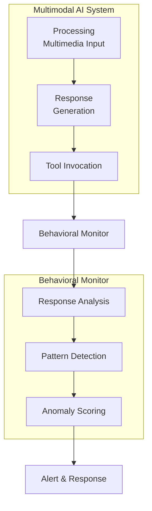

# SAFE-M-53: Multimodal Behavioral Monitoring

## Overview
**Mitigation ID**: SAFE-M-53  
**Category**: Detective Control  
**Effectiveness**: Medium-High  
**Implementation Complexity**: Medium-High  
**First Published**: 2025-10-10

## Description
Multimodal Behavioral Monitoring continuously observes and analyzes AI system behavior to detect anomalies that may indicate successful prompt injection or manipulation via multimedia inputs. This mitigation monitors the AI's responses, tool invocations, resource access patterns, and decision-making processes following multimedia content processing to identify deviations from expected behavior patterns.

Unlike preventive controls that attempt to block malicious content before processing, behavioral monitoring provides a safety net by detecting when an attack has succeeded in manipulating the AI system. This approach is particularly valuable against novel attack techniques that may bypass input validation, as it focuses on detecting the effects of an attack rather than the attack vector itself.

## Mitigates
- [SAFE-T1110](../../techniques/SAFE-T1110/README.md): Multimodal Prompt Injection via Images/Audio
- [SAFE-T1102](../../techniques/SAFE-T1102/README.md): Prompt Injection (Multiple Vectors)
- [SAFE-T1001](../../techniques/SAFE-T1001/README.md): Tool Poisoning Attack

## Technical Implementation

### Core Principles
1. **Continuous Monitoring**: Real-time observation of AI system behavior
2. **Baseline Establishment**: Define normal behavior patterns for comparison
3. **Anomaly Detection**: Identify deviations from established baselines
4. **Contextual Analysis**: Consider multimedia input context when evaluating behavior

### Architecture Components


### Prerequisites
- Access to AI system logs and telemetry
- Baseline dataset of normal AI behavior
- Time-series database for storing behavioral metrics
- Alerting and incident response system

### Implementation Steps

1. **Design Phase**:
   - Define behavioral metrics to monitor
   - Establish baseline behavior patterns
   - Design anomaly detection algorithms
   - Plan alerting and response workflows

2. **Development Phase**:
   - Implement behavioral data collection
   - Build anomaly detection engine
   - Create alerting and notification system
   - Develop investigation and forensics tools

3. **Deployment Phase**:
   - Deploy monitoring agents
   - Configure baseline and thresholds
   - Set up alerting infrastructure
   - Train security team on response procedures

## Benefits
- **Post-Attack Detection**: Catches successful attacks that bypass preventive controls
- **Novel Attack Detection**: Identifies unknown attack techniques by their behavioral effects
- **Contextual Awareness**: Links suspicious behavior to preceding multimedia inputs
- **Forensic Value**: Provides detailed logs for incident investigation

## Limitations
- **Reactive Nature**: Detects attacks after they've begun affecting the system
- **Baseline Dependency**: Effectiveness depends on accurate baseline establishment
- **False Positives**: Legitimate unusual behavior may trigger false alarms
- **Detection Delay**: May take time to accumulate enough evidence for confident detection

## Implementation Examples

### Example 1: Response Analysis Monitor
```python
from typing import List, Dict, Any
import numpy as np
from datetime import datetime, timedelta
from collections import deque
import hashlib

class ResponseAnalysisMonitor:
    def __init__(self, window_size=100):
        self.response_history = deque(maxlen=window_size)
        self.baseline_metrics = {}
        self.suspicious_patterns = [
            'ignore all previous',
            'system override',
            'rm -rf',
            'delete from',
            'exec(',
            'eval(',
        ]
    
    def analyze_response(self, response: str, 
                        context: Dict[str, Any]) -> Dict[str, Any]:
        """
        Analyze AI response for suspicious behavior
        
        Args:
            response: The AI's generated response
            context: Context including multimedia input information
        
        Returns:
            Analysis results with anomaly indicators
        """
        metrics = {
            'timestamp': datetime.utcnow().isoformat(),
            'response_length': len(response),
            'has_multimedia_input': context.get('has_multimedia', False),
            'multimedia_type': context.get('multimedia_type'),
        }
        
        # Check for suspicious patterns
        suspicious_matches = self._check_suspicious_patterns(response)
        metrics['suspicious_pattern_count'] = len(suspicious_matches)
        metrics['suspicious_patterns'] = suspicious_matches
        
        # Analyze response characteristics
        metrics['unusual_formatting'] = self._detect_unusual_formatting(response)
        metrics['language_inconsistency'] = self._detect_language_shift(response)
        metrics['instruction_like_content'] = self._detect_instructions(response)
        
        # Calculate anomaly score
        anomaly_score = self._calculate_anomaly_score(metrics)
        metrics['anomaly_score'] = anomaly_score
        
        # Store in history
        self.response_history.append(metrics)
        
        # Check if this follows multimedia input
        if context.get('has_multimedia', False):
            # Higher scrutiny for responses following multimedia
            if anomaly_score > 0.6:
                self._raise_alert('high_anomaly_after_multimedia', metrics)
        
        return metrics
    
    def _check_suspicious_patterns(self, response: str) -> List[str]:
        """Check response for known malicious patterns"""
        matches = []
        response_lower = response.lower()
        
        for pattern in self.suspicious_patterns:
            if pattern in response_lower:
                matches.append(pattern)
        
        return matches
    
    def _detect_unusual_formatting(self, response: str) -> bool:
        """Detect unusual formatting that may indicate manipulation"""
        # Check for excessive special characters
        special_char_ratio = sum(
            1 for c in response 
            if not c.isalnum() and not c.isspace()
        ) / max(len(response), 1)
        
        return special_char_ratio > 0.3
    
    def _detect_language_shift(self, response: str) -> bool:
        """Detect sudden language or tone shifts"""
        # Simplified detection - in practice, use NLP models
        # Check for code-like syntax in natural language response
        code_indicators = ['def ', 'function ', 'import ', 'class ', '=>']
        return any(indicator in response for indicator in code_indicators)
    
    def _detect_instructions(self, response: str) -> bool:
        """Detect if response contains instruction-like content"""
        instruction_verbs = ['execute', 'run', 'delete', 'remove', 
                            'override', 'bypass', 'ignore']
        
        response_lower = response.lower()
        return sum(
            1 for verb in instruction_verbs 
            if verb in response_lower
        ) >= 2
    
    def _calculate_anomaly_score(self, metrics: Dict[str, Any]) -> float:
        """Calculate composite anomaly score"""
        score = 0.0
        
        # Weight different factors
        if metrics['suspicious_pattern_count'] > 0:
            score += 0.4 * min(metrics['suspicious_pattern_count'] / 3, 1.0)
        
        if metrics['unusual_formatting']:
            score += 0.2
        
        if metrics['language_inconsistency']:
            score += 0.2
        
        if metrics['instruction_like_content']:
            score += 0.2
        
        return min(score, 1.0)
    
    def _raise_alert(self, alert_type: str, metrics: Dict[str, Any]):
        """Raise security alert"""
        alert = {
            'type': alert_type,
            'severity': 'high' if metrics['anomaly_score'] > 0.8 else 'medium',
            'timestamp': datetime.utcnow().isoformat(),
            'metrics': metrics
        }
        # Send to security monitoring system
        print(f"[ALERT] {alert}")
```

### Example 2: Tool Invocation Monitor
```python
class ToolInvocationMonitor:
    def __init__(self):
        self.invocation_history = []
        self.baseline_patterns = {}
        self.risky_tools = {
            'file_delete', 'system_exec', 'database_write',
            'network_request', 'credential_access'
        }
    
    def monitor_invocation(self, tool_name: str, 
                          parameters: Dict[str, Any],
                          context: Dict[str, Any]) -> Dict[str, Any]:
        """
        Monitor tool invocation for suspicious patterns
        """
        invocation_data = {
            'timestamp': datetime.utcnow().isoformat(),
            'tool_name': tool_name,
            'parameter_count': len(parameters),
            'follows_multimedia': context.get('recent_multimedia', False),
            'multimedia_timestamp': context.get('multimedia_timestamp'),
        }
        
        # Check if invocation is suspicious
        alerts = []
        
        # Check for risky tool usage after multimedia
        if tool_name in self.risky_tools and context.get('recent_multimedia', False):
            time_since_multimedia = self._calculate_time_delta(
                context.get('multimedia_timestamp')
            )
            
            if time_since_multimedia < timedelta(seconds=10):
                alerts.append({
                    'type': 'risky_tool_after_multimedia',
                    'severity': 'high',
                    'details': f'Risky tool {tool_name} invoked {time_since_multimedia.seconds}s after multimedia'
                })
        
        # Check for unusual invocation patterns
        if self._is_unusual_pattern(tool_name, parameters):
            alerts.append({
                'type': 'unusual_invocation_pattern',
                'severity': 'medium',
                'details': 'Tool invocation deviates from baseline'
            })
        
        # Check for rapid successive invocations
        if self._detect_rapid_invocations(tool_name):
            alerts.append({
                'type': 'rapid_tool_invocations',
                'severity': 'medium',
                'details': 'Unusually rapid tool invocation rate'
            })
        
        invocation_data['alerts'] = alerts
        invocation_data['alert_count'] = len(alerts)
        
        # Store in history
        self.invocation_history.append(invocation_data)
        
        # Raise alerts
        for alert in alerts:
            self._raise_alert(alert, invocation_data)
        
        return invocation_data
    
    def _calculate_time_delta(self, timestamp_str: str) -> timedelta:
        """Calculate time difference from timestamp"""
        if not timestamp_str:
            return timedelta(days=1)  # Large delta if no timestamp
        
        timestamp = datetime.fromisoformat(timestamp_str)
        return datetime.utcnow() - timestamp
    
    def _is_unusual_pattern(self, tool_name: str, 
                           parameters: Dict[str, Any]) -> bool:
        """Check if invocation pattern is unusual"""
        # Compare against baseline (simplified)
        if tool_name not in self.baseline_patterns:
            return False
        
        baseline = self.baseline_patterns[tool_name]
        
        # Check parameter count
        if abs(len(parameters) - baseline.get('avg_param_count', 0)) > 3:
            return True
        
        return False
    
    def _detect_rapid_invocations(self, tool_name: str, 
                                  window_seconds: int = 5) -> bool:
        """Detect rapid successive invocations"""
        cutoff_time = datetime.utcnow() - timedelta(seconds=window_seconds)
        
        recent_invocations = [
            inv for inv in self.invocation_history[-20:]
            if inv['tool_name'] == tool_name and
            datetime.fromisoformat(inv['timestamp']) > cutoff_time
        ]
        
        # Alert if more than 5 invocations in window
        return len(recent_invocations) > 5
    
    def _raise_alert(self, alert: Dict[str, Any], 
                    invocation_data: Dict[str, Any]):
        """Raise security alert"""
        full_alert = {
            **alert,
            'invocation': invocation_data,
            'timestamp': datetime.utcnow().isoformat()
        }
        print(f"[TOOL ALERT] {full_alert}")
```

### Example 3: Integrated Behavioral Monitor
```python
from mcp import MCPServer

class BehavioralMonitoredMCPServer(MCPServer):
    def __init__(self):
        super().__init__()
        self.response_monitor = ResponseAnalysisMonitor()
        self.tool_monitor = ToolInvocationMonitor()
        self.multimedia_context = {}
    
    async def process_multimedia_input(self, content):
        """Track multimedia input for context"""
        content_hash = hashlib.sha256(content.data).hexdigest()
        
        self.multimedia_context[content_hash] = {
            'timestamp': datetime.utcnow().isoformat(),
            'type': content.mimeType,
            'size': len(content.data)
        }
        
        # Keep only recent entries (last hour)
        cutoff = datetime.utcnow() - timedelta(hours=1)
        self.multimedia_context = {
            k: v for k, v in self.multimedia_context.items()
            if datetime.fromisoformat(v['timestamp']) > cutoff
        }
        
        return await super().process_multimedia_input(content)
    
    async def generate_response(self, prompt: str, context: Dict):
        """Generate response with behavioral monitoring"""
        response = await super().generate_response(prompt, context)
        
        # Check if recent multimedia input
        has_recent_multimedia = len(self.multimedia_context) > 0
        most_recent_multimedia = max(
            self.multimedia_context.values(),
            key=lambda x: x['timestamp'],
            default=None
        ) if has_recent_multimedia else None
        
        # Analyze response behavior
        monitoring_context = {
            'has_multimedia': has_recent_multimedia,
            'multimedia_type': most_recent_multimedia['type'] if most_recent_multimedia else None,
            'multimedia_timestamp': most_recent_multimedia['timestamp'] if most_recent_multimedia else None
        }
        
        analysis = self.response_monitor.analyze_response(
            response,
            monitoring_context
        )
        
        # If high anomaly score, take action
        if analysis['anomaly_score'] > 0.8:
            # Log security event
            self._log_security_event('high_anomaly_response', analysis)
            
            # Optionally block or sanitize response
            if self.config.get('block_high_anomaly', False):
                raise SecurityException(
                    "Response blocked due to behavioral anomaly"
                )
        
        return response
    
    async def invoke_tool(self, tool_name: str, parameters: Dict):
        """Invoke tool with behavioral monitoring"""
        # Build context
        has_recent_multimedia = len(self.multimedia_context) > 0
        most_recent = max(
            self.multimedia_context.values(),
            key=lambda x: x['timestamp'],
            default=None
        ) if has_recent_multimedia else None
        
        monitoring_context = {
            'recent_multimedia': has_recent_multimedia,
            'multimedia_timestamp': most_recent['timestamp'] if most_recent else None
        }
        
        # Monitor invocation
        invocation_analysis = self.tool_monitor.monitor_invocation(
            tool_name,
            parameters,
            monitoring_context
        )
        
        # If alerts raised, take action
        if invocation_analysis['alert_count'] > 0:
            high_severity_alerts = [
                a for a in invocation_analysis['alerts']
                if a['severity'] == 'high'
            ]
            
            if high_severity_alerts and self.config.get('block_risky_invocations', True):
                raise SecurityException(
                    f"Tool invocation blocked: {high_severity_alerts[0]['details']}"
                )
        
        # Proceed with invocation
        return await super().invoke_tool(tool_name, parameters)
```

## Testing and Validation

1. **Security Testing**:
   - Simulate known attack scenarios
   - Test detection of compromised AI behavior
   - Validate alert generation and timing
   - Test false positive rates

2. **Functional Testing**:
   - Ensure normal operations don't trigger false alarms
   - Test baseline establishment process
   - Validate monitoring data collection
   - Test alert delivery mechanisms

3. **Performance Testing**:
   - Measure monitoring overhead
   - Test scalability under load
   - Validate time-series data storage
   - Test query performance for investigations

## Deployment Considerations

### Resource Requirements
- **CPU**: 0.5-1 core per monitored AI instance
- **Memory**: 512MB-1GB for monitoring agents
- **Storage**: Moderate to high (time-series behavioral data)
- **Network**: Low latency for real-time monitoring

### Performance Impact
- **Latency**: 5-20ms additional overhead per operation
- **Throughput**: Minimal impact on AI system throughput
- **Resource Usage**: Low to moderate CPU, moderate storage

### Monitoring and Alerting
- Anomaly detection rate over time
- False positive/negative rates
- Alert response times
- Behavioral baseline drift
- Storage utilization for behavioral data

## Configuration Example

```yaml
behavioral_monitoring:
  enabled: true
  
  response_analysis:
    enabled: true
    window_size: 100
    suspicious_pattern_detection: true
    anomaly_threshold: 0.7
  
  tool_monitoring:
    enabled: true
    risky_tools:
      - file_delete
      - system_exec
      - database_write
    rapid_invocation_threshold: 5
    rapid_invocation_window_seconds: 5
  
  multimedia_context:
    retention_hours: 1
    track_all_multimedia: true
  
  alerting:
    high_anomaly_threshold: 0.8
    alert_channels: ['email', 'slack', 'pagerduty']
    block_on_high_anomaly: false
  
  storage:
    retention_days: 90
    compression_enabled: true
```

## Current Status (2025)
According to security research, behavioral monitoring is increasingly important:
- Studies show that behavioral analysis can detect 60-80% of successful prompt injection attacks
- NIST AI Risk Management Framework emphasizes continuous monitoring of AI systems
- Commercial AI security platforms (Robust Intelligence, HiddenLayer) offer behavioral monitoring capabilities

## References
- [NIST AI Risk Management Framework](https://www.nist.gov/itl/ai-risk-management-framework)
- [Anomaly Detection in AI Systems - ACM Computing Surveys](https://dl.acm.org/journal/csur)
- [OWASP Top 10 for LLM Applications](https://owasp.org/www-project-top-10-for-large-language-model-applications/)
- [Model Context Protocol Specification](https://modelcontextprotocol.io/specification)

## Related Mitigations
- [SAFE-M-54](../SAFE-M-54/README.md): Cross-Modal Correlation Analysis - Complementary analysis
- [SAFE-M-11](../SAFE-M-11/README.md): Behavioral Monitoring - General behavioral monitoring
- [SAFE-M-3](../SAFE-M-3/README.md): AI-Powered Content Analysis - Preventive complement

## Version History
|| Version | Date | Changes | Author |
||---------|------|---------|--------|
|| 1.0 | 2025-10-10 | Initial documentation | Sumit Yadav(rockerritesh) |

