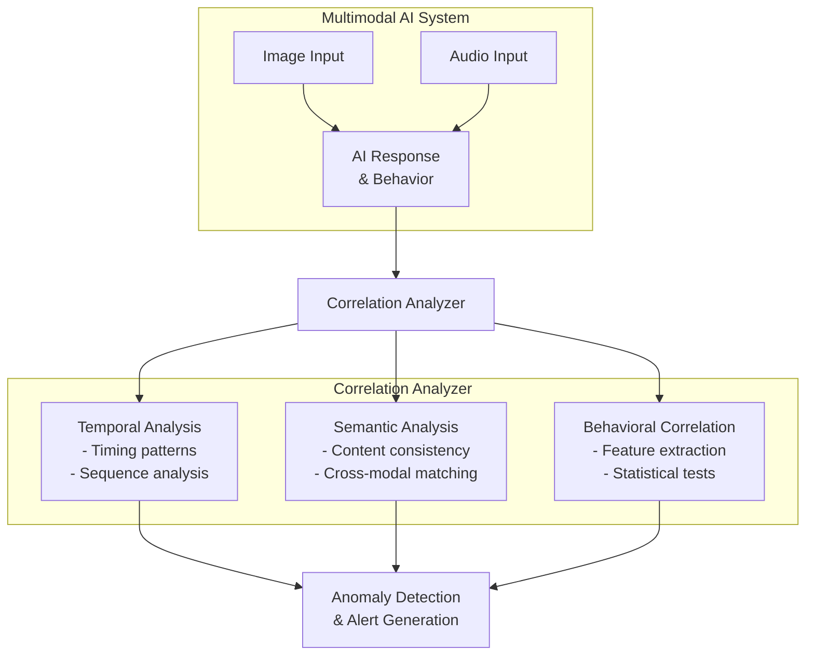

# SAFE-M-54: Cross-Modal Correlation Analysis

## Overview
**Mitigation ID**: SAFE-M-54  
**Category**: Detective Control  
**Effectiveness**: Medium  
**Implementation Complexity**: High  
**First Published**: 2025-10-10

## Description
Cross-Modal Correlation Analysis examines the relationships and consistency between different modalities (text, image, audio) in multimodal AI interactions to detect potential manipulation attempts. This mitigation identifies suspicious patterns where multimedia inputs correlate with unexpected or malicious AI behavior changes, helping to detect sophisticated attacks that exploit the interaction between different input modalities.

The technique works by analyzing temporal patterns (timing of multimedia input versus behavioral changes), semantic consistency (alignment between visual/audio content and AI responses), and behavioral correlation (correlation strength between specific multimedia features and suspicious AI actions). By identifying these correlations, security teams can detect attacks that may bypass single-modality security controls.

## Mitigates
- [SAFE-T1110](../../techniques/SAFE-T1110/README.md): Multimodal Prompt Injection via Images/Audio
- [SAFE-T1102](../../techniques/SAFE-T1102/README.md): Prompt Injection (Multiple Vectors)
- [SAFE-T1401](../../techniques/SAFE-T1401/README.md): Line Jumping

## Technical Implementation

### Core Principles
1. **Multi-Modal Integration**: Analyze interactions across different input modalities
2. **Temporal Correlation**: Track timing relationships between inputs and behaviors
3. **Semantic Consistency**: Verify alignment between modality content and AI responses
4. **Statistical Analysis**: Use statistical methods to identify anomalous correlations

### Architecture Components


### Prerequisites
- Access to multi-modal input logs and AI behavioral logs
- Statistical analysis libraries (scipy, statsmodels)
- Time-series analysis capabilities
- Machine learning frameworks for pattern recognition

### Implementation Steps

1. **Design Phase**:
   - Define correlation metrics and thresholds
   - Design feature extraction for different modalities
   - Establish statistical testing methodology
   - Plan data collection and storage

2. **Development Phase**:
   - Implement multi-modal data collection
   - Build correlation analysis engine
   - Create anomaly detection algorithms
   - Develop visualization and alerting tools

3. **Deployment Phase**:
   - Deploy correlation analysis service
   - Configure correlation thresholds
   - Set up monitoring dashboards
   - Train security analysts on correlation patterns

## Benefits
- **Cross-Modal Attack Detection**: Detects attacks that span multiple modalities
- **Pattern Recognition**: Identifies subtle correlations invisible in single-modality analysis
- **False Positive Reduction**: Confirms suspicions through multi-modal evidence
- **Attack Attribution**: Helps identify which multimedia inputs triggered malicious behavior

## Limitations
- **Computational Complexity**: Requires analysis of large multi-dimensional datasets
- **Data Volume**: Needs significant historical data for accurate correlation
- **False Correlations**: May identify spurious correlations in noisy data
- **Latency**: Analysis may not be real-time for complex correlations

## Implementation Examples

### Example 1: Temporal Correlation Analyzer
```python
from typing import List, Dict, Any, Tuple
from datetime import datetime, timedelta
import numpy as np
from scipy import stats
from collections import defaultdict
from PIL import Image
import io

class TemporalCorrelationAnalyzer:
    def __init__(self, time_window_minutes=10):
        self.time_window = timedelta(minutes=time_window_minutes)
        self.multimedia_events = []
        self.behavioral_events = []
    
    def record_multimedia_event(self, event: Dict[str, Any]):
        """Record multimedia input event"""
        self.multimedia_events.append({
            'timestamp': datetime.fromisoformat(event['timestamp']),
            'type': event['type'],  # 'image', 'audio', 'video'
            'features': event.get('features', {}),
            'content_hash': event.get('content_hash')
        })
        
        # Cleanup old events
        self._cleanup_old_events()
    
    def record_behavioral_event(self, event: Dict[str, Any]):
        """Record AI behavioral event"""
        self.behavioral_events.append({
            'timestamp': datetime.fromisoformat(event['timestamp']),
            'type': event['type'],  # 'response_anomaly', 'tool_invocation', etc.
            'severity': event.get('severity', 'low'),
            'details': event.get('details', {})
        })
        
        # Cleanup old events
        self._cleanup_old_events()
    
    def analyze_correlations(self) -> List[Dict[str, Any]]:
        """
        Analyze temporal correlations between multimedia and behavioral events
        Returns list of detected correlations
        """
        correlations = []
        
        # For each behavioral event, look for preceding multimedia events
        for behavior_event in self.behavioral_events:
            recent_multimedia = self._get_recent_multimedia(
                behavior_event['timestamp']
            )
            
            if recent_multimedia:
                correlation = self._calculate_temporal_correlation(
                    recent_multimedia,
                    behavior_event
                )
                
                if correlation['significant']:
                    correlations.append(correlation)
        
        return correlations
    
    def _get_recent_multimedia(self, timestamp: datetime) -> List[Dict]:
        """Get multimedia events within time window before timestamp"""
        cutoff = timestamp - self.time_window
        
        return [
            event for event in self.multimedia_events
            if cutoff <= event['timestamp'] <= timestamp
        ]
    
    def _calculate_temporal_correlation(self, 
                                       multimedia_events: List[Dict],
                                       behavior_event: Dict) -> Dict[str, Any]:
        """Calculate correlation between multimedia and behavioral event"""
        if not multimedia_events:
            return {'significant': False}
        
        # Get most recent multimedia event
        most_recent = max(multimedia_events, key=lambda e: e['timestamp'])
        
        # Calculate time delta
        time_delta = (behavior_event['timestamp'] - 
                     most_recent['timestamp']).total_seconds()
        
        # Check if correlation is suspicious
        # Short time delta + high severity = suspicious
        is_significant = (
            time_delta < 10 and  # Within 10 seconds
            behavior_event['severity'] in ['high', 'critical']
        )
        
        return {
            'significant': is_significant,
            'multimedia_type': most_recent['type'],
            'multimedia_timestamp': most_recent['timestamp'].isoformat(),
            'behavior_type': behavior_event['type'],
            'behavior_timestamp': behavior_event['timestamp'].isoformat(),
            'time_delta_seconds': time_delta,
            'severity': behavior_event['severity'],
            'confidence': self._calculate_confidence(time_delta, 
                                                     behavior_event['severity'])
        }
    
    def _calculate_confidence(self, time_delta: float, severity: str) -> float:
        """Calculate confidence score for correlation"""
        # Closer in time = higher confidence
        time_score = max(0, 1 - (time_delta / 60))  # Decay over 60 seconds
        
        # Higher severity = higher confidence
        severity_scores = {
            'critical': 1.0,
            'high': 0.8,
            'medium': 0.5,
            'low': 0.2
        }
        severity_score = severity_scores.get(severity, 0.1)
        
        return (time_score * 0.6 + severity_score * 0.4)
    
    def _cleanup_old_events(self):
        """Remove events older than time window"""
        cutoff = datetime.utcnow() - self.time_window * 2
        
        self.multimedia_events = [
            e for e in self.multimedia_events
            if e['timestamp'] > cutoff
        ]
        
        self.behavioral_events = [
            e for e in self.behavioral_events
            if e['timestamp'] > cutoff
        ]
```

### Example 2: Semantic Consistency Analyzer
```python
from transformers import CLIPProcessor, CLIPModel
import torch

class SemanticConsistencyAnalyzer:
    def __init__(self):
        # Load CLIP for multi-modal embeddings
        self.model = CLIPModel.from_pretrained('openai/clip-vit-base-patch32')
        self.processor = CLIPProcessor.from_pretrained('openai/clip-vit-base-patch32')
        self.model.eval()
    
    def analyze_consistency(self, 
                          image_data: bytes,
                          ai_response: str) -> Dict[str, Any]:
        """
        Analyze semantic consistency between image and AI response
        """
        # Get image embedding
        image_embedding = self._get_image_embedding(image_data)
        
        # Get text embedding for AI response
        response_embedding = self._get_text_embedding(ai_response)
        
        # Calculate similarity
        similarity = self._calculate_similarity(
            image_embedding,
            response_embedding
        )
        
        # Also check if response discusses visual content
        discusses_visual_content = self._mentions_visual_content(ai_response)
        
        # Check consistency
        # If response doesn't discuss visual content but follows image input,
        # and similarity is low, it might be suspicious
        is_consistent = True
        suspicion_level = 'none'
        
        if not discusses_visual_content and similarity < 0.3:
            is_consistent = False
            suspicion_level = 'high'
        elif similarity < 0.2:
            is_consistent = False
            suspicion_level = 'medium'
        
        return {
            'consistent': is_consistent,
            'similarity_score': float(similarity),
            'discusses_visual_content': discusses_visual_content,
            'suspicion_level': suspicion_level,
            'analysis': self._generate_analysis(
                similarity, 
                discusses_visual_content,
                suspicion_level
            )
        }
    
    def _get_image_embedding(self, image_data: bytes) -> np.ndarray:
        """Extract CLIP embedding from image"""
        image = Image.open(io.BytesIO(image_data))
        inputs = self.processor(images=image, return_tensors="pt")
        
        with torch.no_grad():
            image_features = self.model.get_image_features(**inputs)
        
        embedding = image_features / image_features.norm(dim=-1, keepdim=True)
        return embedding.cpu().numpy().flatten()
    
    def _get_text_embedding(self, text: str) -> np.ndarray:
        """Extract CLIP embedding from text"""
        inputs = self.processor(text=[text], return_tensors="pt", 
                              padding=True, truncation=True)
        
        with torch.no_grad():
            text_features = self.model.get_text_features(**inputs)
        
        embedding = text_features / text_features.norm(dim=-1, keepdim=True)
        return embedding.cpu().numpy().flatten()
    
    def _calculate_similarity(self, embedding1: np.ndarray, 
                            embedding2: np.ndarray) -> float:
        """Calculate cosine similarity between embeddings"""
        return float(np.dot(embedding1, embedding2))
    
    def _mentions_visual_content(self, text: str) -> bool:
        """Check if text mentions visual/image content"""
        visual_keywords = [
            'image', 'picture', 'photo', 'visual', 'see', 'shown',
            'appears', 'depicts', 'displays', 'illustration'
        ]
        
        text_lower = text.lower()
        return any(keyword in text_lower for keyword in visual_keywords)
    
    def _generate_analysis(self, similarity: float, 
                          discusses_visual: bool,
                          suspicion: str) -> str:
        """Generate human-readable analysis"""
        if suspicion == 'high':
            return (f"High suspicion: AI response has low semantic similarity "
                   f"({similarity:.2f}) to image and doesn't discuss visual content")
        elif suspicion == 'medium':
            return (f"Medium suspicion: AI response has low semantic similarity "
                   f"({similarity:.2f}) to image")
        else:
            return f"Response appears consistent with image input (similarity: {similarity:.2f})"
```

### Example 3: Integrated Cross-Modal Analyzer
```python
class CrossModalCorrelationAnalyzer:
    def __init__(self):
        self.temporal_analyzer = TemporalCorrelationAnalyzer()
        self.semantic_analyzer = SemanticConsistencyAnalyzer()
        self.correlation_history = []
    
    def analyze_interaction(self,
                          multimedia_input: Dict[str, Any],
                          ai_response: str,
                          behavioral_data: Dict[str, Any]) -> Dict[str, Any]:
        """
        Perform comprehensive cross-modal correlation analysis
        """
        # Record events
        self.temporal_analyzer.record_multimedia_event(multimedia_input)
        
        if behavioral_data.get('anomaly_detected'):
            self.temporal_analyzer.record_behavioral_event(behavioral_data)
        
        # Analyze temporal correlations
        temporal_correlations = self.temporal_analyzer.analyze_correlations()
        
        # Analyze semantic consistency (for images)
        semantic_analysis = None
        if multimedia_input['type'] == 'image':
            semantic_analysis = self.semantic_analyzer.analyze_consistency(
                multimedia_input['data'],
                ai_response
            )
        
        # Combine analyses
        combined_analysis = self._combine_analyses(
            temporal_correlations,
            semantic_analysis,
            behavioral_data
        )
        
        # Store in history
        self.correlation_history.append({
            'timestamp': datetime.utcnow().isoformat(),
            'analysis': combined_analysis
        })
        
        # Raise alert if high suspicion
        if combined_analysis['risk_score'] > 0.7:
            self._raise_alert(combined_analysis)
        
        return combined_analysis
    
    def _combine_analyses(self,
                         temporal: List[Dict],
                         semantic: Dict,
                         behavioral: Dict) -> Dict[str, Any]:
        """Combine multiple analyses into final assessment"""
        risk_score = 0.0
        factors = []
        
        # Temporal correlation contribution
        if temporal:
            significant_correlations = [c for c in temporal if c['significant']]
            if significant_correlations:
                risk_score += 0.4
                factors.append({
                    'type': 'temporal_correlation',
                    'weight': 0.4,
                    'details': f"{len(significant_correlations)} significant temporal correlations"
                })
        
        # Semantic consistency contribution
        if semantic and not semantic['consistent']:
            severity_weights = {'high': 0.4, 'medium': 0.2}
            weight = severity_weights.get(semantic['suspicion_level'], 0.1)
            risk_score += weight
            factors.append({
                'type': 'semantic_inconsistency',
                'weight': weight,
                'details': semantic['analysis']
            })
        
        # Behavioral anomaly contribution
        if behavioral.get('anomaly_detected'):
            anomaly_score = behavioral.get('anomaly_score', 0)
            risk_score += anomaly_score * 0.3
            factors.append({
                'type': 'behavioral_anomaly',
                'weight': anomaly_score * 0.3,
                'details': behavioral.get('anomaly_description', 'Behavioral anomaly detected')
            })
        
        return {
            'risk_score': min(risk_score, 1.0),
            'factors': factors,
            'temporal_correlations': temporal,
            'semantic_analysis': semantic,
            'recommendation': self._get_recommendation(risk_score)
        }
    
    def _get_recommendation(self, risk_score: float) -> str:
        """Get recommendation based on risk score"""
        if risk_score >= 0.8:
            return 'BLOCK - High risk of multimodal prompt injection'
        elif risk_score >= 0.6:
            return 'REVIEW - Moderate risk, manual review recommended'
        elif risk_score >= 0.4:
            return 'MONITOR - Low risk, continue monitoring'
        else:
            return 'ALLOW - No significant risk detected'
    
    def _raise_alert(self, analysis: Dict[str, Any]):
        """Raise security alert for high-risk correlations"""
        alert = {
            'type': 'cross_modal_correlation_alert',
            'severity': 'high' if analysis['risk_score'] > 0.8 else 'medium',
            'timestamp': datetime.utcnow().isoformat(),
            'risk_score': analysis['risk_score'],
            'factors': analysis['factors'],
            'recommendation': analysis['recommendation']
        }
        
        print(f"[CROSS-MODAL ALERT] {alert}")
```

## Testing and Validation

1. **Security Testing**:
   - Test with known multi-modal attack scenarios
   - Verify detection of correlated malicious patterns
   - Test with time-delayed attacks
   - Validate cross-modal consistency checking

2. **Functional Testing**:
   - Ensure legitimate multi-modal interactions aren't flagged
   - Test with diverse content types and combinations
   - Validate statistical significance testing
   - Test correlation detection accuracy

3. **Performance Testing**:
   - Measure analysis latency
   - Test scalability with high event volumes
   - Validate data storage and retrieval performance
   - Test real-time versus batch analysis

## Deployment Considerations

### Resource Requirements
- **CPU**: 2-4 cores for correlation analysis
- **Memory**: 2-4GB for analysis engines and data caching
- **Storage**: High (time-series data, embeddings, correlation history)
- **GPU**: Optional but recommended for semantic analysis

### Performance Impact
- **Latency**: 50-500ms for analysis (depends on complexity)
- **Throughput**: 10-100 analyses/second
- **Resource Usage**: Moderate to high CPU, high storage

### Monitoring and Alerting
- Correlation detection rate
- False positive/negative rates
- Analysis latency metrics
- Storage utilization
- Alert response metrics

## Configuration Example

```yaml
cross_modal_correlation:
  enabled: true
  
  temporal_analysis:
    enabled: true
    time_window_minutes: 10
    correlation_threshold: 0.6
  
  semantic_analysis:
    enabled: true
    model: 'openai/clip-vit-base-patch32'
    consistency_threshold: 0.3
    device: 'cuda'
  
  behavioral_correlation:
    enabled: true
    track_tool_invocations: true
    track_response_anomalies: true
  
  risk_assessment:
    alert_threshold: 0.7
    block_threshold: 0.8
    
  storage:
    retention_days: 90
    compression_enabled: true
```

## Current Status (2025)
According to research, cross-modal analysis is an emerging security technique:
- Research on multimodal AI vulnerabilities emphasizes the importance of cross-modal consistency checking
- Commercial AI security platforms are beginning to incorporate multi-modal analysis capabilities
- Academic research continues to explore correlation-based detection methods

## References
- [Abusing Images and Sounds for Indirect Instruction Injection - arXiv:2307.10490](https://arxiv.org/abs/2307.10490)
- [CLIP: Connecting Text and Images - OpenAI](https://openai.com/research/clip)
- [Multimodal Learning with Transformers: A Survey - arXiv:2206.06488](https://arxiv.org/abs/2206.06488)
- [Model Context Protocol Specification](https://modelcontextprotocol.io/specification)

## Related Mitigations
- [SAFE-M-53](../SAFE-M-53/README.md): Multimodal Behavioral Monitoring - Provides behavioral data
- [SAFE-M-51](../SAFE-M-51/README.md): Embedding Anomaly Detection - Provides embedding analysis
- [SAFE-M-50](../SAFE-M-50/README.md): OCR Security Scanning - Provides text extraction

## Version History
|| Version | Date | Changes | Author |
||---------|------|---------|--------|
|| 1.0 | 2025-10-10 | Initial documentation | Sumit Yadav(rockerritesh) |

